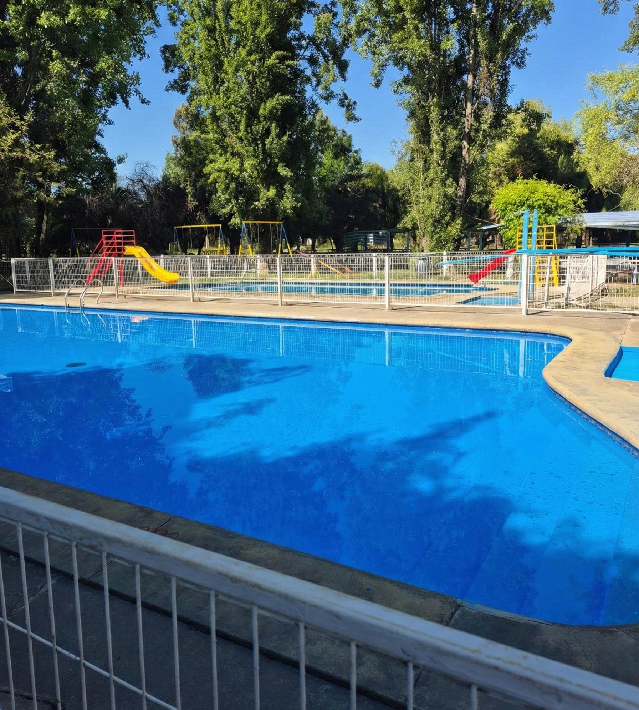

# Las Torcacitas - Mejoras SEO Implementadas

## 📋 Resumen de Mejoras

Este documento detalla todas las optimizaciones SEO implementadas en el sitio web de Las Torcacitas Camping.

---

## 🎯 Mejoras Implementadas

### 1. **Meta Tags Completos**

#### Meta Tags Básicos
- ✅ Título optimizado con palabras clave principales
- ✅ Meta description atractiva y descriptiva (160 caracteres)
- ✅ Keywords relevantes para búsquedas locales
- ✅ Canonical URL para evitar contenido duplicado
- ✅ Meta robots optimizado

#### Open Graph (Facebook/Social Media)
- ✅ og:title, og:description, og:image
- ✅ og:type, og:url, og:locale (es_CL)
- ✅ Dimensiones de imagen optimizadas (1200x630)

#### Twitter Cards
- ✅ twitter:card, twitter:title, twitter:description
- ✅ twitter:image para mejor compartición

#### Geo Tags
- ✅ Coordenadas geográficas para búsquedas locales
- ✅ Región y ubicación específica (Yerbas Buenas, Maule)

---

### 2. **Schema Markup (JSON-LD)**

Se implementó Schema.org estructurado con:

- ✅ **Campground** - Datos del camping
- ✅ **LodgingBusiness** - Información de cabañas
- ✅ **Restaurant** - Datos del restaurante
- ✅ **Organization** - Información de la empresa
- ✅ **BreadcrumbList** - Navegación estructurada
- ✅ **WebSite** - Datos del sitio web

**Beneficios:**
- Rich snippets en Google
- Mejor comprensión por motores de búsqueda
- Mayor tasa de clics (CTR)

---

### 3. **Optimización de Imágenes**

- ✅ Atributos `alt` descriptivos en todas las imágenes
- ✅ `loading="lazy"` para carga diferida
- ✅ `width` y `height` para evitar layout shift
- ✅ Nombres de archivo descriptivos

**Ejemplo:**
```html

```

---

### 4. **Accesibilidad (A11y) y SEO Semántico**

- ✅ Uso correcto de etiquetas semánticas HTML5
- ✅ `role` y `aria-label` en elementos interactivos
- ✅ Navegación con `role="navigation"`
- ✅ Secciones con `aria-labelledby`
- ✅ Botones con `aria-label` descriptivos

**Beneficios:**
- Mejor experiencia para usuarios con discapacidad
- Google valora la accesibilidad
- Mejora el ranking SEO

---

### 5. **Estructura de Encabezados (H1-H6)**

Jerarquía optimizada:
- ✅ **H1**: Solo uno por página (título principal)
- ✅ **H2**: Títulos de secciones principales
- ✅ **H3**: Subtítulos de características
- ✅ Estructura lógica y descriptiva

---

### 6. **URLs y Enlaces**

- ✅ Enlaces con `rel="noopener noreferrer"` para seguridad
- ✅ Anchor links descriptivos (#cabanas, #piscinas, etc.)
- ✅ URLs amigables en anclas
- ✅ Enlaces internos optimizados

---

### 7. **Archivos Técnicos SEO**

#### robots.txt
```
User-agent: *
Allow: /
Sitemap: https://lastorcacitas.cl/sitemap.xml
```

#### sitemap.xml
- URLs principales con prioridades
- Fechas de última modificación
- Frecuencia de cambios
- Image sitemap integrado

#### .htaccess
- Redirección www → no-www
- Forzar HTTPS
- Compresión GZIP
- Cache del navegador
- Headers de seguridad

#### manifest.json
- PWA ready
- Mejor experiencia móvil
- Instalable como app

---

### 8. **Optimización de Rendimiento**

- ✅ Preconnect a Google Fonts
- ✅ Carga diferida de imágenes (lazy loading)
- ✅ Compresión GZIP
- ✅ Cache headers optimizados
- ✅ Minificación recomendada (CSS/JS)

---

## 📊 Palabras Clave Objetivo

### Primarias:
- camping yerbas buenas
- cabañas maule
- camping familiar maule
- piscinas camping

### Secundarias:
- alojamiento maule
- camping chile
- vacaciones maule
- cabañas yerbas buenas

### Long-tail:
- camping con piscina yerbas buenas
- cabañas equipadas región del maule
- camping familiar con restaurant

---

## 🔍 Próximos Pasos Recomendados

### 1. **Google Search Console**
- Verificar propiedad del sitio
- Enviar sitemap.xml
- Monitorear errores de rastreo
- Revisar rendimiento de búsqueda

### 2. **Google My Business**
- Crear perfil de negocio
- Agregar fotos de alta calidad
- Solicitar reseñas
- Mantener información actualizada

### 3. **Contenido Adicional**
- Blog con artículos sobre la región
- FAQ (Preguntas Frecuentes)
- Testimonios de clientes
- Galería de fotos ampliada

### 4. **Link Building**
- Registro en directorios turísticos
- Colaboración con sitios de turismo regional
- Intercambio con negocios locales
- Presencia en redes sociales

### 5. **Optimización Técnica**
- Convertir imágenes a WebP
- Implementar CDN
- Minificar CSS y JavaScript
- Habilitar HTTP/2

### 6. **Métricas y Monitoreo**
- Google Analytics
- Google Tag Manager
- Hotjar o similar (mapas de calor)
- Core Web Vitals

---

## 📱 SEO Local

### Optimizaciones implementadas:
- ✅ Geo tags con coordenadas exactas
- ✅ Schema.org con dirección completa
- ✅ Google Maps integrado
- ✅ Información de contacto visible
- ✅ Horarios de atención claros

### Recomendaciones adicionales:
- Registrarse en TripAdvisor
- Aparecer en guías turísticas locales
- Colaborar con la municipalidad de Yerbas Buenas
- Presencia en portales de turismo del Maule

---

## 🎨 Optimización de Imágenes Pendiente

Para mejor rendimiento, considera:
1. Convertir a formato WebP
2. Crear versiones responsive (srcset)
3. Comprimir sin pérdida de calidad
4. Generar thumbnails optimizados

**Herramientas recomendadas:**
- TinyPNG / TinyJPG
- Squoosh (Google)
- ImageOptim
- WebP Converter

---

## 📝 Checklist Final

- [x] Meta tags completos
- [x] Schema.org JSON-LD
- [x] Alt text en imágenes
- [x] Estructura H1-H6 correcta
- [x] URLs amigables
- [x] robots.txt
- [x] sitemap.xml
- [x] .htaccess optimizado
- [x] manifest.json
- [x] Accesibilidad (ARIA)
- [x] Open Graph
- [x] Twitter Cards
- [x] Geo tags
- [ ] Google Search Console
- [ ] Google Analytics
- [ ] Google My Business
- [ ] Certificado SSL activo
- [ ] Imágenes en WebP
- [ ] Minificación CSS/JS

---

## 🚀 Instrucciones de Despliegue

1. **Subir archivos al servidor:**
   - index.html (reemplazar el actual)
   - robots.txt
   - sitemap.xml
   - .htaccess
   - manifest.json

2. **Verificar URLs:**
   - Actualizar todas las URLs con tu dominio real
   - Cambiar `https://lastorcacitas.cl/` por tu dominio

3. **Configurar SSL:**
   - Asegurar que el sitio use HTTPS
   - Configurar redirección automática

4. **Validar:**
   - Validador HTML de W3C
   - Google Rich Results Test
   - PageSpeed Insights
   - Mobile-Friendly Test

---

## 📧 Contacto

Para consultas sobre estas mejoras:
- Creado por: nicolásdev.cl
- Fecha: Febrero 2026

---

## 📄 Licencia

Todos los derechos reservados © 2026 Las Torcacitas